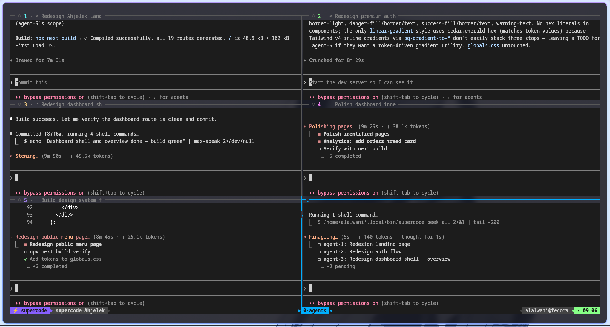

# supercode

A local multi-agent engineering team that turns one feature request into a spec, assigns specialized agents, coordinates file ownership, verifies the result, reviews the diff, and safely merges the work.




## Why

A single AI coding agent is powerful. But real projects have multiple independent pieces -- an API, a frontend, tests, database migrations, documentation. Doing them one at a time is slow.

**supercode** runs multiple Claude Code agents in parallel, each in an isolated git worktree, with a Brain agent that orchestrates the whole thing. It can plan the work, assign specialized roles, enforce shared contracts, review the output, and verify it builds.

```bash
supercode "add email/password auth with dashboard redirect"
```

This launches the Brain. You talk to it, it picks the right roles (max 5 agents), creates a spec and contracts, then you run `supercode dispatch` to launch the agents.

## How it works

1. **Talk** -- You run `supercode` and describe what you want to build
2. **Plan** -- Brain analyzes the task, picks roles, creates spec + contracts + plan.json
3. **Launch** -- Brain runs `supercode dispatch` itself — agents appear as new panes
4. **Coordinate** -- Brain monitors progress, resolves blockers, prevents conflicts
5. **Review** -- Reviewer agent inspects all diffs against the spec
6. **Verify** -- QA runs build/test/lint across all worktrees
7. **Save** -- All agent work merges into your branch with conflict prediction

## The Brain

The Brain is the first thing that launches. It's your team lead.

When you run `supercode`, the Brain:

1. **Talks to you** to understand what you want to build
2. **Picks the right roles** -- up to 5 specialized agents from 17 available roles
3. **Creates contracts** -- shared interfaces, naming conventions, file ownership -- so agents don't conflict
4. **Writes the plan** -- SPEC.md, CONTRACTS.md, AGENTS.md, and plan.json
5. **Launches the agents** -- runs `supercode dispatch` itself, agents appear as new panes
6. **Coordinates** -- monitors progress via `supercode peek all` and follows up with stuck agents

## Install

```bash
git clone https://github.com/Haro321/supercode.git
cd supercode
./install.sh
```

**Requires:** Bash 4+, git, tmux, [Claude Code CLI](https://docs.anthropic.com/en/docs/claude-code) (`claude` in PATH). Optional: `jq` (for JSON state export).

Run `supercode doctor` to verify your setup.

## Quick start

```bash
# Default: Brain launches, you talk, it plans and launches agents itself
supercode

# With context: Brain gets your task, plans, and launches agents automatically
supercode "add user dashboard with settings"

# Skip planning: launch preset roles immediately
supercode --preset webapp "add checkout page"

# Skip planning: specify exact roles
supercode --roles backend,frontend,qa "add API keys feature"
```

## Agent roles

Instead of generic numbered workers, supercode assigns specialized roles:

```bash
supercode --preset webapp "add checkout page"
# Launches: architect, backend, frontend, database, qa

supercode --preset bugfix "fix login redirect loop"
# Launches: reproducer, debugger, fixer, qa

supercode --roles backend,frontend,security "add API keys feature"
# Launches: exactly the roles you specify
```

### Available presets

| Preset | Roles |
|--------|-------|
| `webapp` | architect, backend, frontend, database, qa |
| `api` | architect, api, backend, database, security, qa |
| `fullstack` | architect, backend, frontend, database, qa, reviewer |
| `ui` | architect, frontend, ux, accessibility, qa |
| `mobile-app` | architect, mobile, backend, api, qa |
| `ml-project` | architect, ml, data, backend, qa |
| `llm-app` | architect, prompt, backend, api, qa |
| `bugfix` | reproducer, debugger, fixer, qa |
| `refactor` | mapper, refactor, compatibility, qa |
| `modernize` | mapper, legacy, refactor, compatibility, qa |
| `perf` | mapper, performance, qa |
| `incident` | sre, debugger, fixer, qa |
| `security` | architect, security, backend, qa |
| `reverse` | reverser, mapper, security, docs |

Run `supercode presets` or `supercode roles` to see all options.

### Available roles

| Role | Responsibility |
|------|---------------|
| `architect` | System design, API contracts, data models, file ownership |
| `api` | API contract design (REST, GraphQL, gRPC): schemas, versioning, auth, pagination |
| `backend` | Server logic, endpoints, services, middleware, business rules |
| `frontend` | UI components, pages, forms, client-side state, routing |
| `mobile` | iOS, Android, React Native, Flutter — offline, push, deep links |
| `database` | Schemas, migrations, seeds, indexes, queries |
| `data` | ETL/ELT pipelines, warehouses, streaming, schema evolution |
| `ml` | Model training, inference, evals, deployment, drift monitoring |
| `prompt` | Prompt design, evals, output schemas, cost/latency tuning for LLM apps |
| `qa` | Tests (unit, integration, e2e), build/lint/typecheck verification |
| `performance` | Profiling, benchmarks, latency/memory/bundle/battery optimization |
| `security` | Vulnerability audits: injection, auth bypass, secrets, supply chain |
| `reviewer` | Code review against spec, contracts, and architecture fit |
| `sre` | SLIs/SLOs, error budgets, observability, incident response, runbooks |
| `devops` | CI/CD, Dockerfiles, deployment configs, infra-as-code |
| `ux` | Interaction flows, error/loading/empty states, user feedback |
| `accessibility` | WCAG AA, ARIA, keyboard nav, focus management, contrast |
| `docs` | README, API docs, runbooks, ADRs, CHANGELOG |
| `mapper` | Codebase mapping: deps, call graphs, module boundaries, impact analysis |
| `refactor` | Behavior-preserving structural improvements |
| `legacy` | Modernize legacy code with gradual, parallel-run migrations |
| `compatibility` | Backward compatibility: API stability, migration paths, version skew |
| `reproducer` | Minimal failing reproduction for a reported bug |
| `debugger` | Root cause investigation (no patching) |
| `fixer` | Targeted fix + regression test |
| `reverser` | Binary reverse engineering with Ghidra and gdb/x64dbg |

## Default workflow

This is the standard way to use supercode:

```bash
# Step 1: Launch Brain -- tell it what you want (or just chat)
supercode "add email/password auth with dashboard redirect"

# Step 2: Brain plans, picks roles, and launches agents automatically
# ... agent panes appear in the tmux session ...

# Step 3: Monitor progress
supercode status
supercode peek all

# Step 5: Review
supercode review

# Step 6: Verify
supercode verify

# Step 7: Save
supercode save --dry-run
supercode save
```

The Brain creates these files in `.supercode/`:

| File | Purpose |
|------|---------|
| `SPEC.md` | Requirements and acceptance criteria |
| `CONTRACTS.md` | Shared API contracts, types, interfaces |
| `AGENTS.md` | Agent role assignments and tasks |
| `plan.json` | Machine-readable plan for `supercode dispatch` |
| `ownership.json` | File ownership rules per role |
| `REVIEW.md` | Review findings (created by `supercode review`) |

## File ownership

Agents are assigned file ownership to prevent conflicts:

```bash
supercode claim backend "src/api/**"
supercode claim frontend "src/components/**"
supercode claims                          # show ownership map
supercode conflicts                       # detect violations
```

When roles are used, default ownership is assigned automatically. `supercode save` checks for ownership violations before merging.

## Brain subcommands

Talk to the Brain directly:

```bash
supercode brain plan         # ask brain to create planning docs
supercode brain status       # ask brain to check all agents and update STATUS.md
supercode brain reassign 3 "also handle error states"
supercode brain unblock      # ask brain to help stuck agents
supercode brain review       # ask brain to review all agent work
supercode brain summarize    # get a full project summary
```

## Approval gates

Control agent work:

```bash
supercode approve backend       # approve an agent's approach
supercode approve 3             # approve by agent number
supercode reject frontend "do not change the auth middleware"
```

## Monitoring

```bash
supercode status              # agents, roles, dirty state, commits
supercode status --json       # machine-readable state
supercode peek all            # screen content of every agent
supercode peek 3              # check one agent
supercode diff all            # files changed per agent
supercode logs brain          # captured brain log
supercode logs 1 --tail 100   # agent 1's log
```

## Verification

Auto-detects your project type and runs the right commands:

```bash
supercode verify              # runs test/lint/build per worktree
supercode verify --cmd "pytest && mypy ."   # custom commands
```

Supported: Node/React/Next.js, Python/Django/FastAPI, Rust, Go, PHP, Ruby, Java.

## Saving

```bash
supercode save --dry-run               # preview with conflict prediction + ownership checks
supercode save                         # commit + merge all agents
supercode save --into feature/result   # merge into a different branch
supercode unsave                       # undo the last save
supercode rollback                     # rewind to pre-launch state
```

Protected branches (`main`, `master`, `production`) trigger a warning before merge.

## Is this safe?

- **Isolation**: Each agent gets its own git worktree and branch. No shared working directory.
- **Rollback**: Pre-launch snapshot recorded. `supercode rollback` undoes everything.
- **Dry runs**: `supercode save --dry-run` previews merges, predicts conflicts, checks ownership.
- **Guarded cleanup**: `supercode clean` refuses to delete unsaved work without `--force`.
- **Protected branches**: Warning before saving into main/master/production.
- **Path safety**: All `rm -rf` operations verify paths are inside `SUPERCODE_HOME`.
- **Ownership enforcement**: `supercode save` reports files modified outside assigned ownership.

## Configuration

| Variable | Default | Description |
|----------|---------|-------------|
| `SUPERCODE_HOME` | `~/.supercode` | Where worktrees are stored |
| `SUPERCODE_AGENTS` | `5` | Default worker count (when not using presets/roles) |
| `SUPERCODE_CLAUDE_ARGS` | *(empty)* | Extra args for `claude` (e.g. `--dangerously-skip-permissions`) |
| `SUPERCODE_BOOT_DELAY` | `3` | Seconds to wait for claude to boot |
| `SUPERCODE_SNAPSHOT` | `commit` | Pre-launch handling: `commit`, `stash`, or `none` |

## Project structure

```
supercode/
  supercode                    # main entry point
  lib/
    ui.sh                      # colors and output helpers
    git.sh                     # git helpers and safety guards
    tmux_helpers.sh            # tmux pane helpers and theme
    agents.sh                  # agent labels and accents
    brain.sh                   # brain prompts and pane creation
    session.sh                 # session state tracking
    roles.sh                   # 17 agent roles, 10 presets
    contracts.sh               # file ownership, project detection, contracts
    commands/
      plan.sh                  # plan phase (spec + contracts)
      dispatch.sh              # role-based agent dispatch
      start.sh                 # classic launch (with --preset/--roles support)
      save.sh                  # merge with dry-run, conflict prediction, ownership
      review_cmd.sh            # reviewer agent
      verify.sh                # QA verification
      claim.sh                 # file ownership management
      approve.sh               # approval/rejection gates
      brain_cmd.sh             # brain subcommands
      status.sh                # role-aware status display
      ...                      # tell, broadcast, peek, diff, logs, etc.
  tests/                       # bats test suite (32 tests)
  install.sh
```

## Known limitations

- The Brain coordinates via prompts, not a strict lock manager. Logical conflicts can still happen.
- `save` may hit merge conflicts if agents modify the same files despite ownership rules.
- Running many Claude sessions uses API quota quickly.
- Works best in terminal/tmux environments.
- `jq` is optional but required for JSON state export and ownership enforcement.

## License

MIT
